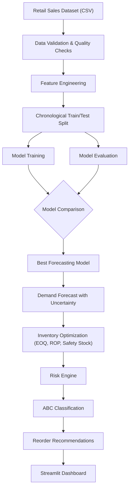
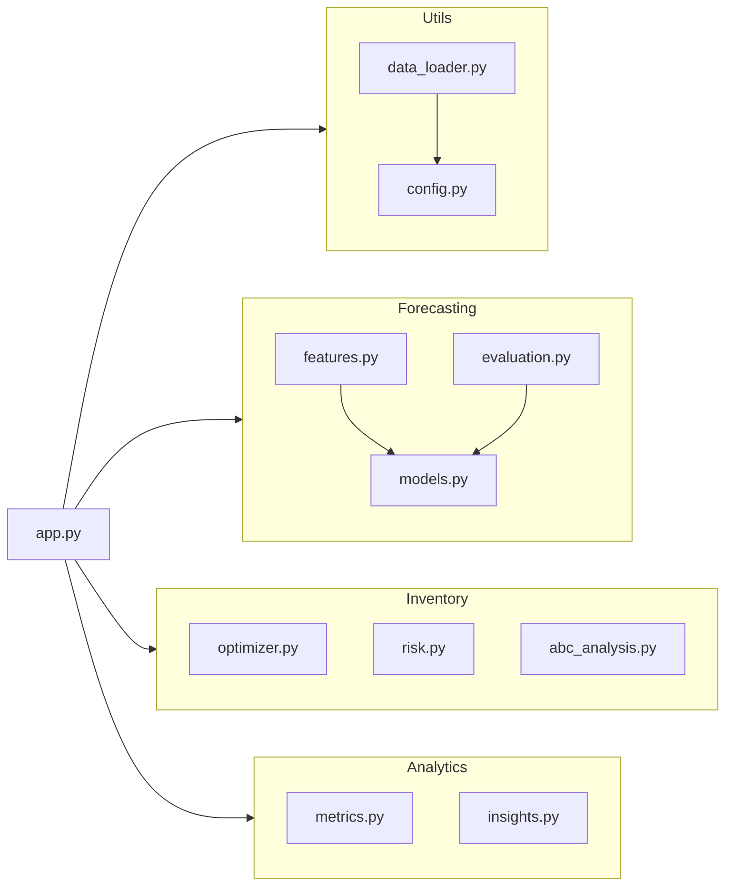
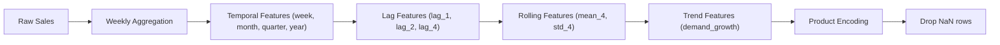

# Architecture — Retail Supply Chain and Inventory Optimizer

## System Overview

This application is a retail supply chain decision-support platform that transforms historical sales data into actionable inventory management recommendations.

## Data Flow

## Module Architecture

## Component Details

### Data Layer (`src/utils/`)

| Module | Responsibility |
|--------|---------------|
| `config.py` | Central configuration: paths, defaults, constants |
| `data_loader.py` | CSV loading, data validation, quality reporting |

**Data Validation Checks:**
- Missing values in required columns
- Duplicate rows
- Invalid/unparseable dates
- Negative units_sold
- Zero/negative unit_price
- Empty product identifiers
- Empty categories

### Forecasting Layer (`src/forecasting/`)

| Module | Responsibility |
|--------|---------------|
| `features.py` | Feature engineering pipeline with leakage prevention |
| `models.py` | Model training, comparison, prediction with uncertainty |
| `evaluation.py` | Chronological splitting, metrics computation |

**Feature Engineering Pipeline:**

**Leakage Prevention:**
- Lag features use `shift()` to reference only past periods
- Rolling features use `shift(1)` before computing window statistics
- Product encoding is fitted only on training data
- Train/test split is strictly chronological (no random shuffling)

**Model Comparison:**

| Model | Type | Purpose |
|-------|------|----------|
| Naive Baseline | Last known value | Lower-bound benchmark |
| Random Forest | Ensemble (bagging) | Captures non-linear patterns |
| Gradient Boosting | Ensemble (boosting) | Sequential error correction |

**Evaluation Methodology:**
- Chronological split: training on earlier dates, testing on later dates
- Metrics: MAE, RMSE, R², MAPE
- Best model selected by lowest MAE on test set
- No training-set evaluation used for model selection

**Prediction Intervals:**
- Method: Residual-based intervals
- Level: 90% (configurable)
- Formula: forecast ± z × residual_std
- These are prediction intervals, not confidence intervals

### Inventory Layer (`src/inventory/`)

| Module | Responsibility |
|--------|---------------|
| `optimizer.py` | Safety Stock, Reorder Point, EOQ calculations |
| `risk.py` | Inventory risk classification and action recommendations |
| `abc_analysis.py` | ABC/Pareto inventory classification |

**Inventory Formulas:**

| Formula | Expression | Purpose |
|---------|-----------|----------|
| Safety Stock | z × σ_d × √LT | Buffer against demand variability |
| Reorder Point | d̄ × LT + SS | When to order |
| EOQ | √(2DS/H) | How much to order |

**Risk Classification:**

| Risk Level | Condition | Action |
|-----------|-----------|--------|
| Stockout Risk | Inventory ≤ Safety Stock | Order Immediately |
| Reorder Soon | Inventory ≤ Reorder Point | Reorder Soon |
| Monitor | Inventory ≤ ROP + SS | Monitor |
| Healthy | Above thresholds | No Action Required |
| Overstock | Inventory > 3 × EOQ | No Action Required |

**ABC Classification:**
- A items: Top ~70% cumulative revenue contribution
- B items: Next ~20% (70-90% cumulative)
- C items: Remaining ~10% (90-100%)
- Priority integrates ABC class with risk level

### Analytics Layer (`src/analytics/`)

| Module | Responsibility |
|--------|---------------|
| `metrics.py` | Business KPIs, category/product performance |
| `insights.py` | Automated alert generation, demand insights |

### Presentation Layer (`src/app.py`)

**Dashboard Pages:**

| Page | Purpose |
|------|----------|
| Executive Dashboard | KPIs, risk overview, alerts, trends |
| Demand Forecasting | Product-level forecast with uncertainty |
| Inventory Optimization | EOQ, ROP, safety stock analysis |
| Inventory Risk | Risk classification, reorder recommendations |
| Product Intelligence | Single-SKU deep-dive |
| Scenario Simulator | What-if analysis |
| Sales Analytics | Trends, ABC analysis, category performance |
| Model Evaluation | Comparison table, feature importance, methodology |

## Technology Stack

| Component | Technology |
|-----------|------------|
| Language | Python 3.10+ |
| ML | Scikit-Learn (RandomForest, HistGradientBoosting) |
| Data | Pandas, NumPy |
| Visualization | Matplotlib |
| Dashboard | Streamlit |
| Testing | pytest |
| CI | GitHub Actions |

## Dataset Characteristics

| Property | Value |
|----------|-------|
| Rows | 90 |
| Products | 5 (Laptop, Smartphone, Rice 5kg, Wheat Flour, T-Shirt) |
| Categories | 3 (Electronics, Groceries, Apparel) |
| Time Period | Jan–Apr 2024 (18 weeks) |
| Frequency | Weekly |
| Store | Single store (S1) |

**Limitations:**
- Small dataset (90 rows) limits model complexity and validation depth
- Single store limits geographic generalization
- 18-week window provides limited seasonal pattern capture
- Architecture is designed to scale to larger datasets

## Design Decisions

1. **Chronological validation over cross-validation**: Time series data requires temporal ordering; random CV would leak future information.

2. **Residual-based prediction intervals over bootstrap**: Simpler, transparent, and appropriate for the dataset size.

3. **User-configurable current inventory**: The dataset doesn't contain inventory levels, so current inventory is a simulation input rather than a fabricated value.

4. **Modest model set (3 models)**: Adding more models without sufficient data leads to overfitting the model selection process.

5. **ABC thresholds (70/20/10)**: Standard industry practice. Documented as assumptions, not absolute truth.
